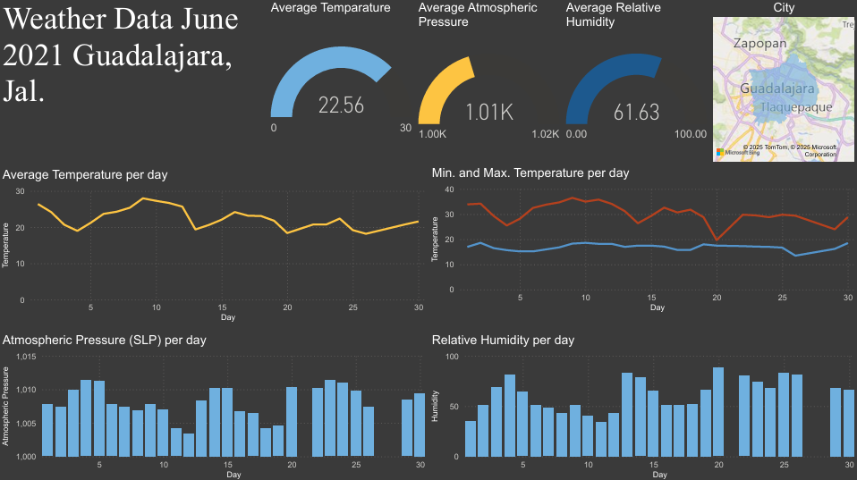

  
  

# 📊 DataViz Challenge - Análisis y Visualización de Datos

🏆 **DataViz Challenge Future Lab** | 📅 [2021]

📍 **Categoría:** Análisis y Visualización de Datos

📌 **Tecnologías utilizadas:** **Jupyter Notebooks, Python (Pandas), Power BI**

---

## 📌 Descripción
Este proyecto fue desarrollado para la competencia **DataViz Challenge**, con el objetivo de analizar y visualizar datos de manera efectiva.  
- Se utilizó **Python (Pandas)** en **Jupyter Notebook** para la **limpieza, transformación y análisis exploratorio de datos (EDA)**.  
- Se implementó un **dashboard en Power BI** para la visualización interactiva de los resultados obtenidos.  

---

## 📂 Estructura del Repositorio
🔹 **data/** → Contiene los archivos CSV utilizados en el análisis.  

🔹 **notebooks/** → Contiene los **Jupyter Notebooks** con el código de análisis y limpieza de datos.  

🔹 **images/** → Contiene capturas de pantalla de los resultados obtenidos en el análisis.  

🔹 **powerbi/** → Contiene el archivo **Power BI (.pbix)** con los dashboards generados.  

---

## 🚀 Instalación y Uso
**Clonar el repositorio**  

    git clone https://github.com/CamarenaAI/DataViz-Challenge.git
    cd DataViz-Challenge

⚙️ [Alonso Ismael Camarena](https://www.linkedin.com/in/camarenaai/)